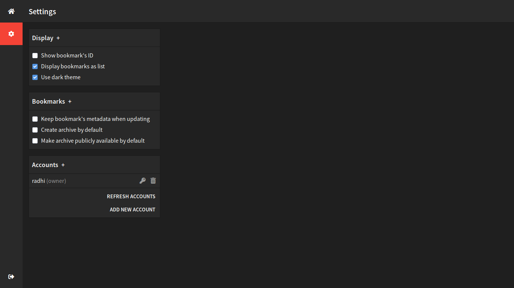
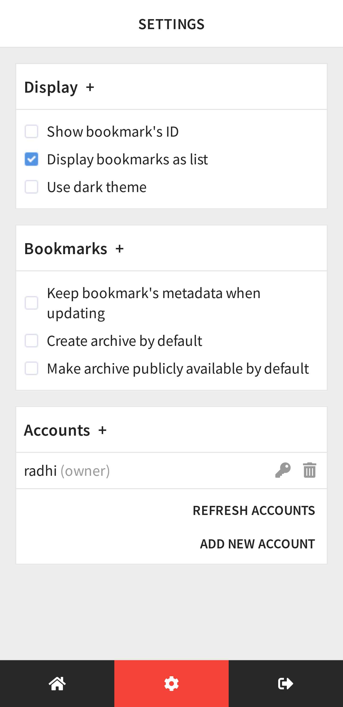

Desktop
---

<table style="width:100%">
    <tr align="center">
        <td colspan="2">
            <b>Login screen</b>
        </td>
    </tr>
    <tr valign="top" align="center">
        <td width="50%">
            
        </td>
        <td width="50%">
            
        </td>
    </tr>
    <tr align="center">
        <td colspan="2">
            <b>Grid mode</b>
        </td>
    </tr>
    <tr valign="top" align="center">
        <td width="50%">
            
        </td>
        <td width="50%">
            
        </td>
    </tr>
    <tr align="center">
        <td colspan="2">
            <b>List mode</b>
        </td>
    </tr>
    <tr valign="top" align="center">
        <td width="50%">
            
        </td>
        <td width="50%">
            
        </td>
    </tr>
    <tr align="center">
        <td colspan="2">
            <b>Options page</b>
        </td>
    </tr>
    <tr valign="top" align="center">
        <td width="50%">
            
        </td>
        <td width="50%">
            
        </td>
    </tr>
</table>

Mobile
------

<table style="width:100%">
    <tr align="center">
        <td colspan="2">
            <b>Login screen</b>
        </td>
        <td colspan="2">
            <b>Grid mode</b>
        </td>
    </tr>
    <tr valign="top" align="center">
        <td width="25%">
            
        </td>
        <td width="25%">
            
        </td>
        <td width="25%">
            
        </td>
        <td width="25%">
            
        </td>
    </tr>
    <tr align="center">
        <td colspan="2">
            <b>List mode</b>
        </td>
        <td colspan="2">
            <b>Options page</b>
        </td>
    </tr>
    <tr valign="top" align="center">
        <td width="25%">
            
        </td>
        <td width="25%">
            
        </td>
        <td width="25%">
            
        </td>
        <td width="25%">
            
        </td>
    </tr>
</table>
